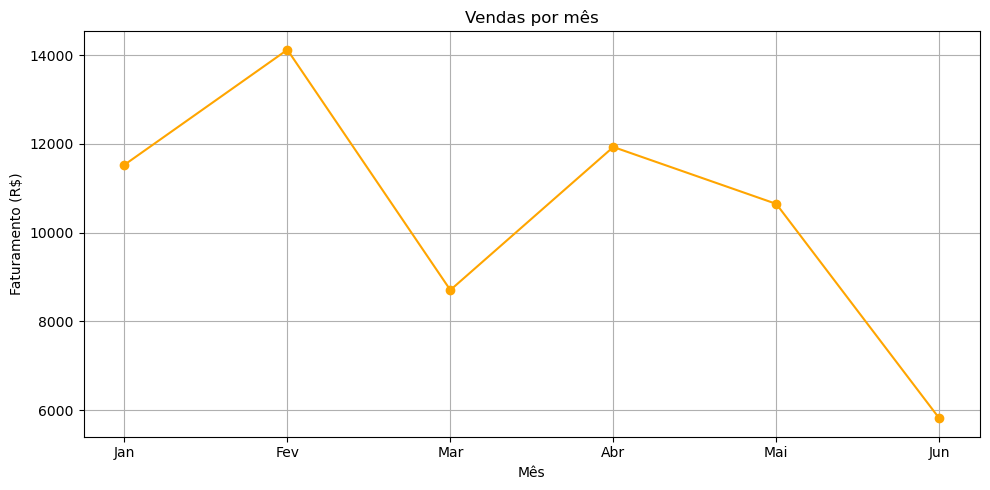

# Análise de Vendas de uma Loja Fictícia

O objetivo deste projeto é analisar os dados de vendas de uma loja fictícia para identificar padrões de faturamento, comportamento de compra e tendências ao longo do tempo, utilizando técnicas de análise exploratória de dados (EDA).

## Tecnologias utilizadas

- Python
- Pandas
- Matplotlib
- Jupyter Notebook

## Estrutura do projeto

```
projeto_dados/
│
├── data/
│   └── vendas_loja_ficticia.csv
│
├── src/
│   ├── carregar_dados.py
│   ├── limpeza.py
│   ├── analises.py
│   └── visualizacao.py
│
├── analise_loja.ipynb
├── requirements.txt
└── README.md
```

## Análises realizadas

- Receita total
- Produtos mais vendidos
- Faturamento por cidade
- Faturamento por categoria
- Distribuição das formas de pagamento
- Evolução das vendas ao longo do tempo
- Faturamento mensal

## Principais insights

- Identificação das cidades com maior faturamento.
- Identificação dos produtos mais vendidos.
- Comparação do faturamento entre categorias.
- Análise da evolução das vendas ao longo do período.
- Comparação do faturamento entre os meses analisados.

## Exemplos de gráficos

Produtos mais vendidos: 

Faturamento por cidade: 

Quantidade de vendas por categoria: 

Formas de pagamento: 

Vendas ao longo do tempo: 

Vendas mensais: 

## Como executar

Clone o repositório:

```bash
git clone https://github.com/seu-usuario/data-sales-project.git
```

Instale as dependências:

```bash
pip install -r requirements.txt
```

Abra o notebook:

```bash
jupyter notebook analise_loja.ipynb
```

## Autor

Murilo Henrique Nellis