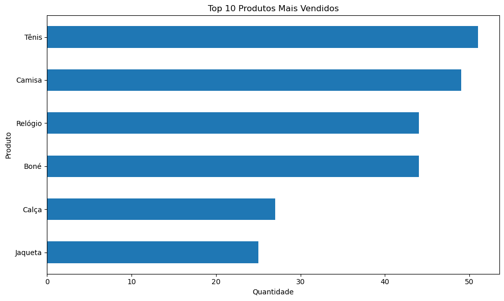
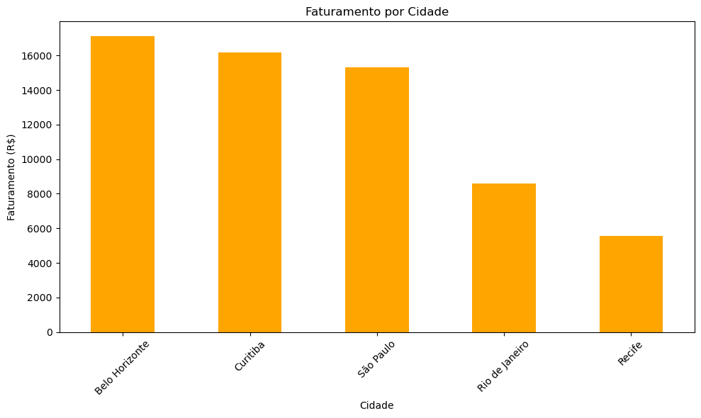
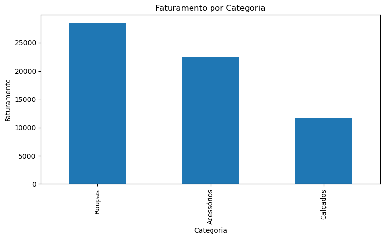
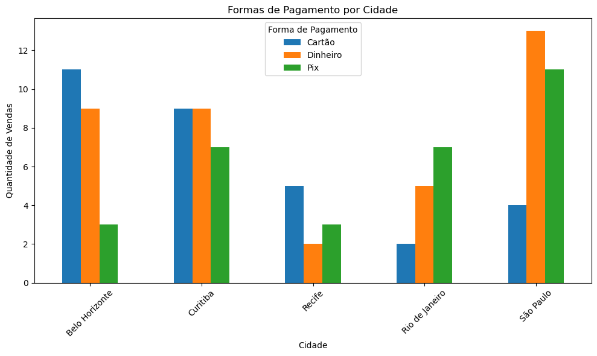
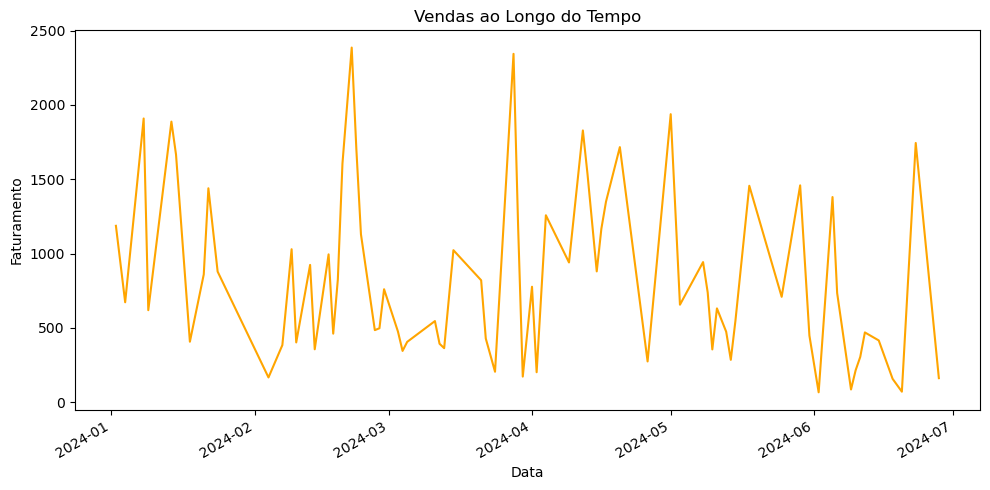

# 📊 Análise de Vendas de uma Loja Fictícia

O objetivo deste projeto é analisar os dados de vendas de uma loja fictícia para identificar padrões de faturamento, comportamento de compra e tendências ao longo do tempo, utilizando técnicas de análise exploratória de dados (EDA).

## Tecnologias utilizadas

- Python
- Pandas
- Matplotlib
- Jupyter Notebook

## Estrutura do projeto

```
analise-vendas/
│
├── data/
│   └── vendas_loja_ficticia.csv
│
├── images/
│   ├── produtos.png
│   ├── faturamento_cidade.png
│   ├── faturamento_categoria.png
│   ├── pagamentos.png
│   └── vendas_mensais.png
│
├── src/
│   ├── __init__.py
│   ├── carregar_dados.py
│   ├── limpeza.py
│   ├── analises.py
│   └── visualizacao.py
│
├── .gitignore
├── analise_loja.ipynb
├── LICENSE
├── README.md

```

## Análises realizadas

- Receita total
- Produtos mais vendidos
- Faturamento por cidade
- Faturamento por categoria
- Distribuição das formas de pagamento
- Faturamento mensal

## Principais insights

- Identificação dos produtos mais vendidos.
- Identificação das cidades com maior faturamento.
- Comparação do faturamento entre categorias.
- Comparação das formas de pagamento mais utilizadas.
- Comparação do faturamento entre os meses analisados.

## Exemplos de gráficos

Produtos mais vendidos: 

Faturamento por cidade: 

Quantidade de vendas por categoria: 

Formas de pagamento: 

Vendas mensais: 

## Como executar

Clone o repositório:

```bash
git clone https://github.com/seu-usuario/analise-vendas.git
```

Instale as dependências:

```bash
pip install -r requirements.txt
```

Abra o notebook:

```bash
jupyter notebook analise_loja.ipynb
```


A análise permitiu identificar os produtos com maior volume de vendas, as cidades responsáveis pelo maior faturamento, as categorias com maior faturamento, a distribuição das formas de pagamento e o comportamento do faturamento ao longo dos meses, fornecendo uma visão geral do desempenho da loja.

## Autor

Murilo Henrique Nellis